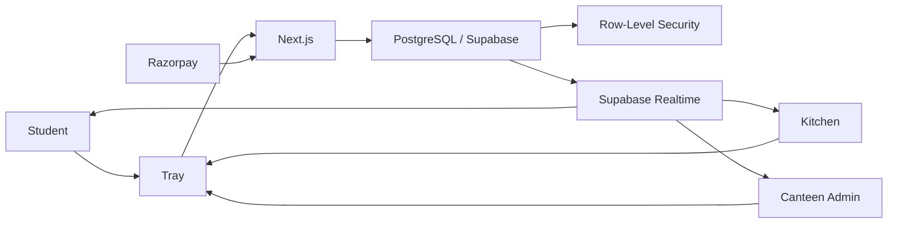
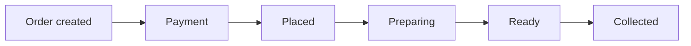

# Tray

A multi-tenant ordering system for college canteens and small food stalls.

Students can order and pay before reaching the counter, kitchen staff receive orders in real time, and canteen operators manage menus, orders, staff, stock and reports from their own dashboard.

**Live:** https://trayy.vercel.app  
**GitHub:** https://github.com/thribhuvan003/tray

---

## Why I built it

Tray started from a simple problem in my college.

During short lunch breaks, students could spend a large part of the break standing in the canteen queue just to order food.

The first idea was simple:

**Order from the classroom → pay online → reach the canteen → collect when ready.**

But a college can have multiple canteens.

Instead of building a separate application for every canteen, Tray was designed as a **multi-tenant system** where:

- students get one common ordering experience
- each canteen has its own kitchen
- each canteen has its own admin dashboard
- menus, orders, staff and payments remain isolated between canteens

---

## Try the demos

No account is required.

| Portal | Demo |
| --- | --- |
| Student | https://trayy.vercel.app/demo/student |
| Kitchen | https://trayy.vercel.app/demo/kitchen |
| Admin | https://trayy.vercel.app/demo/admin |

---

## How Tray works


```mermaid
flowchart LR
    Student["Student"] --> App["Tray"]
    Kitchen["Kitchen"] --> App
    Admin["Canteen Admin"] --> App

    App --> Next["Next.js"]
    Next --> DB["PostgreSQL / Supabase"]

    DB --> RLS["Row-Level Security"]
    DB --> Realtime["Supabase Realtime"]

    Razorpay["Razorpay"] --> Next

    Realtime --> Student
    Realtime --> Kitchen
    Realtime --> Admin
```

Tray uses one application and one PostgreSQL-backed system for multiple canteens.

Every tenant-scoped record carries a `tenant_id`, and PostgreSQL **Row-Level Security** helps prevent one canteen from accessing another canteen's data.

---

## Order flow


```mermaid
flowchart LR
    A["Order created"] --> B["Payment"]
    B --> C["Placed"]
    C --> D["Preparing"]
    D --> E["Ready"]
    E --> F["Collected"]
```

When the order state changes, the application emits order events which are delivered to the relevant portals through **Supabase Realtime**.

If realtime connectivity is unavailable, the application also has a polling fallback.

---

## Key engineering decisions

### Multi-tenancy

Tray supports multiple colleges and canteens from one deployment.

Tenant isolation is enforced using PostgreSQL Row-Level Security instead of relying only on frontend filters.

### Payment verification

For Razorpay payments, the browser is not treated as the final source of truth.

Payment events are verified on the server before the order is marked as successfully paid.

### Idempotency

Payment providers can retry the same webhook.

Tray handles payment processing so the same successful event does not intentionally process the order twice.

### Concurrent inventory

Two students may try to purchase the last available item at the same time.

Stock validation and decrementing are handled atomically in PostgreSQL with row locking to reduce overselling during concurrent requests.

### Realtime updates

Student, kitchen and admin portals receive order updates without requiring a manual refresh.

### Auditability

Important order changes are recorded through status logs, order events and audit logs so failures can be investigated later.

### Background jobs

Scheduled work such as expiring unpaid orders is handled using Upstash QStash rather than depending on a browser remaining open.

---

## Payments

Tray supports two payment approaches.

**Razorpay**

Gateway payments are verified server-side using Razorpay's payment flow and webhook handling.

**Direct UPI**

Some smaller operators may accept payments directly to their UPI VPA.

Because direct peer-to-peer UPI transfers cannot be verified through the same gateway webhook flow, Tray keeps those payments visibly unverified until staff confirms them.

---

## Tech stack

| Area | Technology |
| --- | --- |
| Frontend | Next.js 15, React 19 |
| Language | TypeScript |
| Database | PostgreSQL |
| Backend | Supabase |
| Authentication | Supabase Auth |
| Realtime | Supabase Realtime |
| Storage | Supabase Storage |
| Payments | Razorpay, UPI |
| Rate limiting | Upstash Redis |
| Scheduled jobs | Upstash QStash |
| Testing | Vitest, Playwright |
| Monitoring | Sentry |
| Deployment | Vercel |

---

## Repository structure

```text
tray/
├── docs/
│   ├── adr/                 architecture decisions
│   └── specs/               implementation notes
│
├── src/
│   ├── app/
│   │   ├── (student)/       student ordering
│   │   ├── (kitchen)/       kitchen operations
│   │   ├── (admin)/         canteen administration
│   │   ├── college-admin/   college-level management
│   │   ├── demo/            public demos
│   │   └── api/             webhooks and background jobs
│   │
│   ├── components/
│   ├── lib/
│   └── __tests__/
│
├── supabase/
│   └── migrations/          database migrations
│
├── scripts/
├── README.md
├── CONTRIBUTING.md
└── SECURITY.md
```

---

## Local setup

### Requirements

- Node.js 22
- pnpm 10
- Supabase project

Clone the project:

```bash
git clone https://github.com/thribhuvan003/tray.git
cd tray
```

Install dependencies:

```bash
pnpm install --frozen-lockfile
```

Create your environment file:

```bash
cp .env.example .env.local
```

Add the required values from `.env.example`.

Start the application:

```bash
pnpm dev
```

Open:

```text
http://localhost:3000
```

---

## Database

Database migrations are stored in:

```text
supabase/migrations/
```

Apply them in filename order.

```bash
supabase link --project-ref <your-project-ref>
supabase db push
```

---

## Tests and checks

```bash
pnpm lint
pnpm typecheck
pnpm test
pnpm build
```

The repository includes tests around areas such as:

- payment integrity
- webhook idempotency
- concurrent stock
- order creation
- kitchen actions
- UPI handling
- rate limiting
- admin validation

---

## Architecture decisions

Some important technical decisions are documented separately:

- [Multi-tenancy with PostgreSQL RLS](docs/adr/0001-multi-tenant-via-rls.md)
- [Pickup OTP design](docs/adr/0002-otp-at-ready.md)
- [Scheduled jobs with QStash](docs/adr/0003-qstash-scheduled-jobs.md)
- [Razorpay and direct-UPI payment modes](docs/adr/0004-payment-mode-direct-upi.md)

---

## What I learned

Tray started as a small idea to reduce a lunch queue.

Building it forced me to think about problems beyond the interface:

- tenant isolation
- payment correctness
- duplicate webhook events
- concurrent inventory updates
- realtime state synchronization
- failure handling
- auditability

Those engineering problems became the most valuable part of the project.

---

## License

MIT
