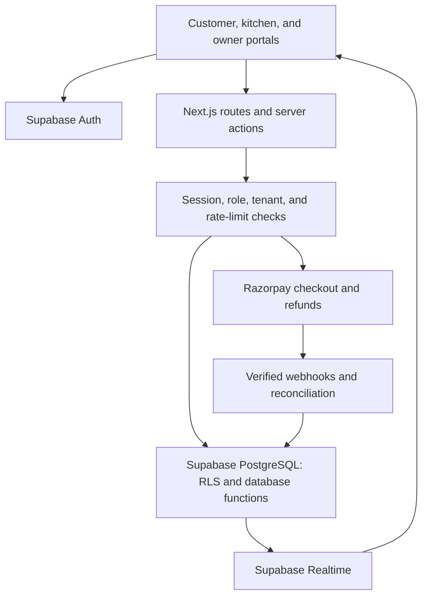

# Tray

An ordering system for street stalls, tiffin centres, and canteens. Customers order from a browser, staff manage the queue, and owners keep track of their menu, stock, and sales. One deployment can serve independent stalls or several canteens within a college.

[Live site](https://trayy.vercel.app) · [Set up a stall](https://trayy.vercel.app/get-started) · [Contributing](./CONTRIBUTING.md)

## Why I built it

Tray started from a simple problem in my college. During short lunch breaks, students could spend a large part of the break standing in the canteen queue just to order food.

The first idea was simple: order from the classroom, pay online, reach the canteen, and collect when ready. Since a college can have several canteens, each needed its own menu, kitchen, dashboard, and isolated data within one application.

## Try it

These demos use sample data in your browser. No sign-in, real orders, or payments are involved.

| Demo | What to try |
| --- | --- |
| [Customer menu](https://trayy.vercel.app/demo/student) | Add items, simulate a payment, and follow an order. |
| [Kitchen board](https://trayy.vercel.app/demo/kitchen) | Move an order through preparation, ready, and collection. |
| [Owner dashboard](https://trayy.vercel.app/demo/admin) | Explore orders, menu controls, and sales across sample stalls. |

Open the demos in the same browser and select the same stall to follow an order across portals. They share local storage; production uses Supabase.

## How it works

1. An owner creates a stall and configures its menu and payment details.
2. A customer opens the menu, signs in, and places an order.
3. Payment is confirmed according to the stall's payment mode.
4. Staff prepare the order, mark it ready, and verify the customer's four-digit pickup code at collection.

Owners can manage availability, stock, staff access, orders, refunds, and reports. College administrators can oversee multiple canteens. The default order flow includes a kitchen queue; token-only service is also available for stalls using automatic Razorpay payments.

### Payments

| Mode | Confirmation | Refunds |
| --- | --- | --- |
| **Direct UPI** (default) | Customers pay the stall's UPI ID. Their claim enters the queue as unverified. Staff check their own bank or UPI app before confirming payment and starting preparation. | The merchant repays manually; Tray records the refund owed. |
| **Razorpay** (optional) | Checkout payments are verified on the server. Webhooks and reconciliation handle payment updates. | The server requests a gateway refund and tracks its status. |

A customer screenshot or pickup code is not proof of payment. Duplicate Razorpay capture events are handled idempotently. Database functions coordinate payment transitions and inventory reservations or releases.

## Architecture

Next.js 15, React 19, TypeScript, and Tailwind CSS power the application. Supabase provides authentication, PostgreSQL, file storage, and Realtime. Vercel hosts the app; Upstash Redis provides distributed rate limiting.


```mermaid
flowchart TD
  Portals["Customer, kitchen, and owner portals"] --> Auth["Supabase Auth"]
  Portals --> App["Next.js routes and server actions"]
  App --> Checks["Session, role, tenant, and rate-limit checks"]
  Checks --> DB["Supabase PostgreSQL: RLS and database functions"]
  Checks --> Gateway["Razorpay checkout and refunds"]
  Gateway --> Hooks["Verified webhooks and reconciliation"]
  Hooks --> DB
  DB --> Realtime["Supabase Realtime"]
  Realtime --> Portals
```

- **Tenant scope:** a stall or canteen is a tenant. Routes such as `/c/<slug>/menu` resolve that tenant; Supabase clients pass its ID through `x-tenant-id`. PostgreSQL row-level security uses the tenant context and user permissions.
- **Access:** production order placement requires a signed-in customer. Staff and admin actions also check the user's role. Server-only service-role operations bypass RLS and must explicitly enforce tenant scope.
- **Updates:** active portals subscribe to Realtime, with polling as a fallback. The browser-only demos are separate from this production path.
- **Background work:** QStash can schedule order expiry and payment reconciliation. Resend handles optional transactional email.

Design decisions and their history are in [`docs/adr`](./docs/adr).

### Engineering decisions

- **Tenant isolation:** PostgreSQL RLS enforces access alongside server-side role and tenant checks.
- **Payment correctness:** server verification and idempotent handling protect against repeated gateway events.
- **Concurrent stock:** database functions and row locking coordinate inventory changes when orders compete for the same item.
- **Auditability:** status logs, order events, and audit logs help investigate failures.

Read the decisions on [multi-tenancy](./docs/adr/0001-multi-tenant-via-rls.md), [pickup codes](./docs/adr/0002-otp-at-ready.md), [scheduled jobs](./docs/adr/0003-qstash-scheduled-jobs.md), and [payment modes](./docs/adr/0004-payment-mode-direct-upi.md).

## Run locally

Use **Node.js 22** and **pnpm 10**, matching CI.

```bash
git clone https://github.com/thribhuvan003/tray.git
cd tray
pnpm install --frozen-lockfile
cp .env.example .env.local
```

Edit `.env.local` before starting the app. Use your own development Supabase project, not the example project's URL.

| Configuration | When needed |
| --- | --- |
| `NEXT_PUBLIC_SUPABASE_URL`, `NEXT_PUBLIC_SUPABASE_ANON_KEY` | Required to start the app. Use the URL and public key from your Supabase project. |
| `SUPABASE_SERVICE_ROLE_KEY` | Server-side provisioning and privileged operations. Keep this secret. |
| `APP_URL` | The app's origin; use `http://localhost:3000` locally. |
| `UPSTASH_REDIS_REST_URL`, `UPSTASH_REDIS_REST_TOKEN` | Required for production builds and runtime. Development has an in-memory fallback. |
| `RAZORPAY_KEY_ID`, `RAZORPAY_KEY_SECRET`, `RAZORPAY_WEBHOOK_SECRET` | For Razorpay payments; start with test credentials and select Razorpay in the stall's payment settings. |
| `RESEND_API_KEY`, `RESEND_FROM_EMAIL` | Optional email; the sender must be verified in Resend. |
| `QSTASH_URL`, `QSTASH_TOKEN`, `QSTASH_CURRENT_SIGNING_KEY`, `QSTASH_NEXT_SIGNING_KEY` | Optional scheduled jobs. |

See [`.env.example`](./.env.example) for the template. Never put service-role, gateway, or webhook secrets in `NEXT_PUBLIC_*` variables.

For database-backed features, install the Supabase CLI and apply all migrations to your development project:

```bash
supabase link --project-ref YOUR_DEVELOPMENT_PROJECT_REF
supabase db push
```

Migrations live in [`supabase/migrations`](./supabase/migrations) and must run in filename order before the matching application is deployed. Apply the complete set rather than stopping at a migration mentioned in an older design document. Configure Supabase Auth's site URL and allowed redirect URLs for your app origin.

```bash
pnpm dev
```

Open [localhost:3000](http://localhost:3000). Start with `/demo/student`, `/demo/kitchen`, or `/demo/admin` to explore the UI without creating production data.

## Checks

```bash
pnpm typecheck
pnpm lint
pnpm test
pnpm demo:verify
pnpm build
```

`demo:verify` checks source and route contracts. To run browser checks, install Chromium with `pnpm exec playwright install chromium`, then keep the built app running with `pnpm start` in another terminal:

```bash
pnpm demo:verify:e2e
pnpm landing:audit
```

The landing audit captures desktop, tablet, and mobile layouts and checks accessibility. Set `DEMO_BASE` or `LANDING_BASE` to test another deployment; both scripts also accept `--base=https://example.com`.

## Where to look

| Path | Contents |
| --- | --- |
| [`src/app`](./src/app) | Pages, server actions, API routes, and demo portals |
| [`src/components`](./src/components) | Landing page, portal UI, and shared components |
| [`src/lib`](./src/lib) | Auth, tenant resolution, payments, rate limits, and Supabase clients |
| [`src/__tests__`](./src/__tests__) | Vitest tests |
| [`supabase/migrations`](./supabase/migrations) | Schema, permissions, and transactional database functions |
| [`scripts`](./scripts) | Demo verification and landing-page browser checks |

See [CONTRIBUTING.md](./CONTRIBUTING.md) for development conventions and [SECURITY.md](./SECURITY.md) for private vulnerability reporting.

## What I learned

Tray started as a small idea to reduce a lunch queue. Building it forced me to think beyond the interface: tenant isolation, payment correctness, duplicate webhook events, concurrent inventory, realtime synchronization, failure handling, and auditability. Those engineering problems became the most valuable part of the project.

## License

[MIT](./LICENSE)
