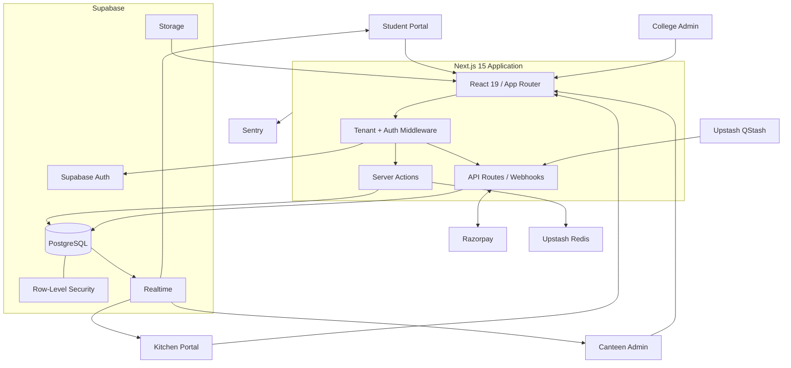
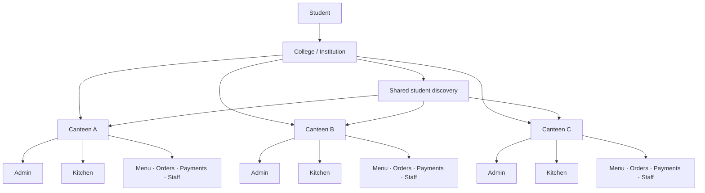
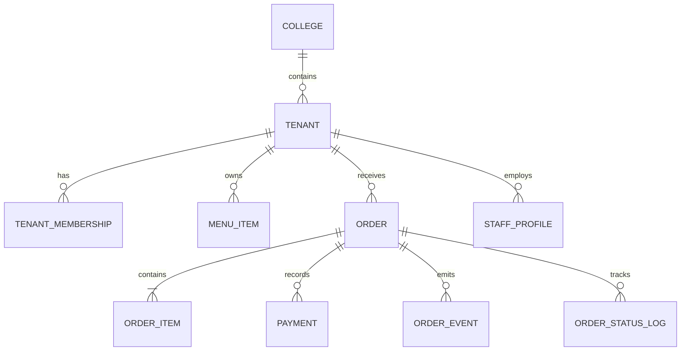
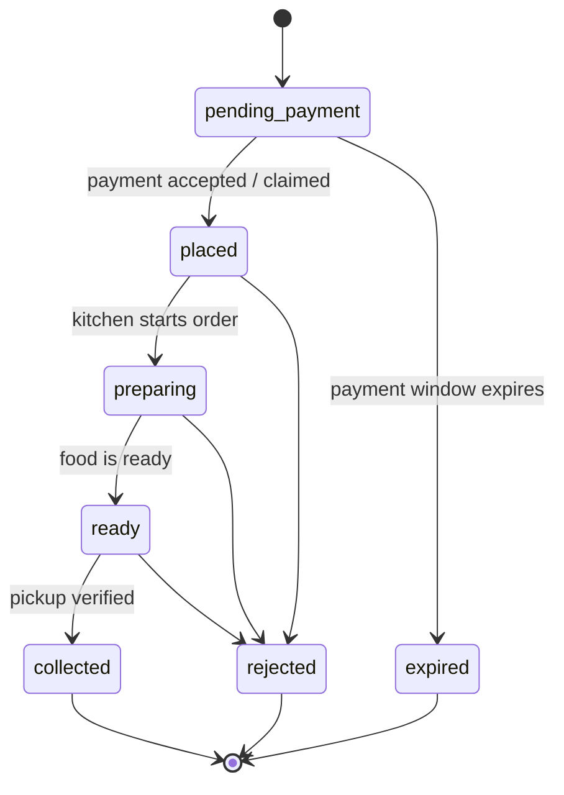
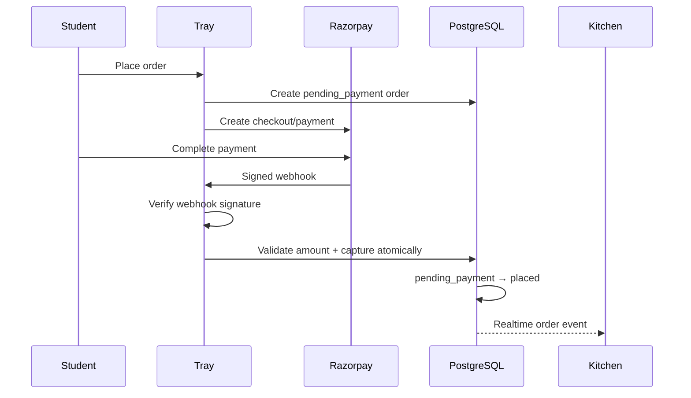
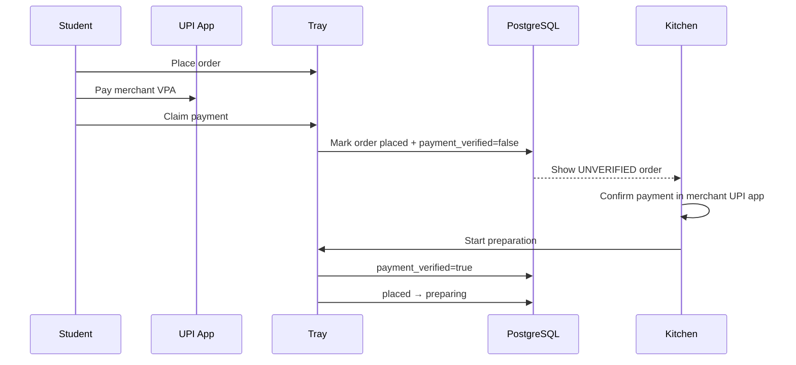
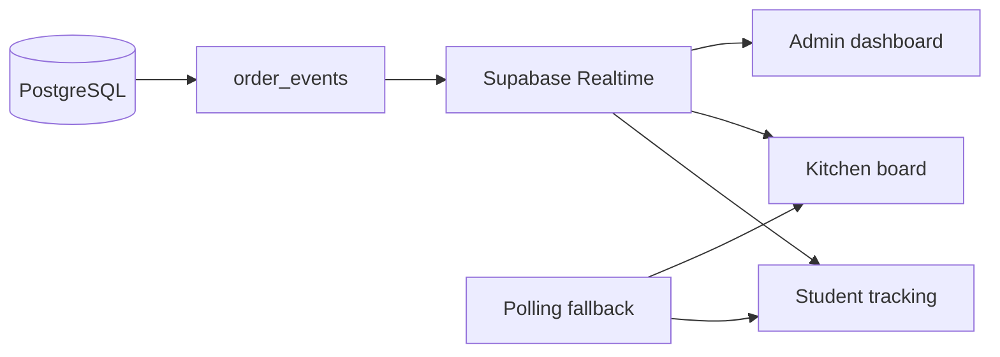
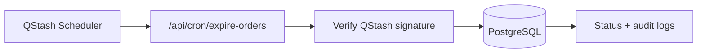

# Tray

> Multi-tenant ordering infrastructure for campus canteens and independent food stalls — built around real-time operations, tenant isolation, payment correctness, and fast pickup.

[](https://nextjs.org/)
[](https://react.dev/)
[](https://www.typescriptlang.org/)
[](https://www.postgresql.org/)
[](https://trayy.vercel.app)
[](LICENSE)

**Live product:** [trayy.vercel.app](https://trayy.vercel.app)

**Repository:** [github.com/thribhuvan003/tray](https://github.com/thribhuvan003/tray)

---

## Why I built Tray

Tray started with a simple problem from my own college.

During short lunch breaks, students could spend a large part of the break standing in a canteen queue — first to order, then again to collect food.

The first idea was simple:

**order from the classroom → pay digitally → walk to the canteen when the order is ready → collect it using a pickup code.**

But building this for only one canteen would have been the easy version.

A college may have several independently operated canteens. Each operator needs their own menu, staff, kitchen queue, payments, stock and reports, while students should still have one common experience.

That turned Tray into a **multi-tenant SaaS-style system**.

The same architecture can also support independent food stalls outside campuses: the tenant boundary stays the same while the discovery context changes.

---

## Try it without creating an account

The public demos use browser-local demo data, so anyone reviewing the project can explore the core workflows immediately.

| Experience | Demo |
| --- | --- |
| Student ordering | [Open Student Demo](https://trayy.vercel.app/demo/student) |
| Kitchen operations | [Open Kitchen Demo](https://trayy.vercel.app/demo/kitchen) |
| Canteen administration | [Open Admin Demo](https://trayy.vercel.app/demo/admin) |

---

## What Tray does

### Student

Students can:

- discover available canteens
- browse live menus
- add items to a cart
- place and pay for an order
- track order status in real time
- receive a pickup code when the order is ready
- collect without waiting in the ordering queue

### Kitchen

Kitchen staff can:

- receive incoming orders
- start preparation
- mark orders ready
- verify pickup
- reject problematic orders
- create walk-in cash orders
- control sold-out items
- view active kitchen workload

### Canteen operator

Operators can manage:

- menu items and availability
- inventory
- kitchen staff
- service availability
- payment configuration
- orders and refunds
- operational analytics
- exports and reports

### College administration

A college-level administrator can oversee the canteens associated with an institution without merging the operational data of independently managed outlets.

---

# System architecture

Tray runs as a single Next.js deployment backed by a shared PostgreSQL database, while tenant boundaries are enforced below the UI layer.


```mermaid
flowchart TB
    Student["Student Portal"]
    Kitchen["Kitchen Portal"]
    Admin["Canteen Admin"]
    CollegeAdmin["College Admin"]

    Student --> Web
    Kitchen --> Web
    Admin --> Web
    CollegeAdmin --> Web

    subgraph APP["Next.js 15 Application"]
        Web["React 19 / App Router"]
        Middleware["Tenant + Auth Middleware"]
        Actions["Server Actions"]
        API["API Routes / Webhooks"]
    end

    Web --> Middleware
    Middleware --> Actions
    Middleware --> API

    subgraph DATA["Supabase"]
        Auth["Supabase Auth"]
        DB[("PostgreSQL")]
        RLS["Row-Level Security"]
        RT["Realtime"]
        Storage["Storage"]
    end

    Middleware --> Auth
    Actions --> DB
    API --> DB

    DB --- RLS
    DB --> RT
    RT --> Student
    RT --> Kitchen
    RT --> Admin

    Storage --> Web

    Razorpay["Razorpay"]
    Redis["Upstash Redis"]
    QStash["Upstash QStash"]
    Sentry["Sentry"]

    API <--> Razorpay
    Actions --> Redis
    QStash --> API
    APP --> Sentry
```

The application is intentionally not split into separate deployments for every canteen.

Instead:

- one application serves many tenants
- one PostgreSQL database stores tenant-scoped data
- every important tenant-owned row carries a `tenant_id`
- authorization is enforced using PostgreSQL Row-Level Security
- request middleware resolves the current tenant
- server-side operations retain explicit tenant context
- realtime events remain tenant-scoped

This makes tenant isolation a database concern rather than something every UI query must remember manually.

---

# Multi-tenant model

At the product level the hierarchy is:


```mermaid
flowchart TD
    College["College / Institution"]

    College --> CanteenA["Canteen A"]
    College --> CanteenB["Canteen B"]
    College --> CanteenC["Canteen C"]

    CanteenA --> AdminA["Admin"]
    CanteenA --> KitchenA["Kitchen"]
    CanteenA --> DataA["Menu · Orders · Payments · Staff"]

    CanteenB --> AdminB["Admin"]
    CanteenB --> KitchenB["Kitchen"]
    CanteenB --> DataB["Menu · Orders · Payments · Staff"]

    CanteenC --> AdminC["Admin"]
    CanteenC --> KitchenC["Kitchen"]
    CanteenC --> DataC["Menu · Orders · Payments · Staff"]

    Student["Student"]
    Student --> College

    College --> Discovery["Shared student discovery"]
    Discovery --> CanteenA
    Discovery --> CanteenB
    Discovery --> CanteenC
```

Students can discover multiple canteens belonging to their college, while the operational portals of each canteen remain isolated.

The underlying model is approximately:


```mermaid
erDiagram
    COLLEGE ||--o{ TENANT : contains
    TENANT ||--o{ TENANT_MEMBERSHIP : has
    TENANT ||--o{ MENU_ITEM : owns
    TENANT ||--o{ ORDER : receives
    TENANT ||--o{ STAFF_PROFILE : employs

    ORDER ||--|{ ORDER_ITEM : contains
    ORDER ||--o{ PAYMENT : records
    ORDER ||--o{ ORDER_EVENT : emits
    ORDER ||--o{ ORDER_STATUS_LOG : tracks
```

---

# Tenant isolation

A major design goal is:

> A bug in application code should not be enough to expose another canteen's data.

Tray therefore uses PostgreSQL Row-Level Security for tenant-scoped tables.

Conceptually:

```text
request
   ↓
resolve tenant from route/subdomain
   ↓
attach tenant context
   ↓
Supabase / PostgreSQL request
   ↓
RLS policy checks tenant_id
   ↓
only rows belonging to the active tenant are visible
```

This protects against accidentally forgetting an application-side filter such as:

```ts
.eq("tenant_id", tenantId)
```

Critical service-role operations such as payment webhooks and scheduled jobs bypass normal RLS, so those paths explicitly validate and filter tenant ownership.

See:

- [`docs/adr/0001-multi-tenant-via-rls.md`](docs/adr/0001-multi-tenant-via-rls.md)
- [`src/lib/tenant.ts`](src/lib/tenant.ts)
- [`src/middleware.ts`](src/middleware.ts)

---

# Order lifecycle

Orders are modeled as controlled state transitions rather than arbitrary status updates.


```mermaid
stateDiagram-v2
    [*] --> pending_payment

    pending_payment --> placed: payment accepted / claimed
    pending_payment --> expired: payment window expires

    placed --> preparing: kitchen starts order
    preparing --> ready: food is ready
    ready --> collected: pickup verified

    placed --> rejected
    preparing --> rejected
    ready --> rejected

    collected --> [*]
    rejected --> [*]
    expired --> [*]
```

Order transitions also generate operational records such as:

- `order_events`
- `order_status_logs`
- audit events

Those events support realtime updates, debugging and operational traceability.

---

# Payment design

Payments were one of the more important engineering problems in Tray.

The system currently supports **two tenant-level payment modes**.

## 1. Razorpay

For tenants using Razorpay:


```mermaid
sequenceDiagram
    participant S as Student
    participant T as Tray
    participant R as Razorpay
    participant DB as PostgreSQL
    participant K as Kitchen

    S->>T: Place order
    T->>DB: Create pending_payment order
    T->>R: Create checkout/payment
    S->>R: Complete payment
    R->>T: Signed webhook
    T->>T: Verify webhook signature
    T->>DB: Validate amount + capture atomically
    DB->>DB: pending_payment → placed
    DB-->>K: Realtime order event
```

The application does **not** trust the browser alone to declare a payment successful.

Server-side processing validates the gateway event and updates the payment/order ledger.

The capture path is designed to be idempotent: receiving a repeated event must not create a second successful transition.

---

## 2. Direct UPI

Some smaller operators may want customers to pay directly to the merchant's UPI VPA rather than through a payment gateway.

A raw peer-to-peer UPI payment cannot be reliably verified through a public application webhook.

Tray therefore treats the flow differently:


```mermaid
sequenceDiagram
    participant S as Student
    participant U as UPI App
    participant T as Tray
    participant DB as PostgreSQL
    participant K as Kitchen

    S->>T: Place order
    S->>U: Pay merchant VPA
    S->>T: Claim payment
    T->>DB: Mark order placed + payment_verified=false
    DB-->>K: Show UNVERIFIED order
    K->>K: Confirm payment in merchant UPI app
    K->>T: Start preparation
    T->>DB: payment_verified=true
    T->>DB: placed → preparing
```

This distinction is intentional.

Tray does not pretend that a direct bank-to-bank UPI transfer has been programmatically verified when the system has no authoritative confirmation source.

See:

- [`docs/adr/0004-payment-mode-direct-upi.md`](docs/adr/0004-payment-mode-direct-upi.md)
- [`supabase/migrations/0031_atomic_payment_and_inventory.sql`](supabase/migrations/0031_atomic_payment_and_inventory.sql)

---

# Inventory correctness

Checkout also has to handle concurrency.

Two customers may attempt to purchase the last available item at nearly the same time.

Inventory reservation therefore happens in PostgreSQL rather than relying only on a client-side stock value.

The database path:

1. validates all requested items
2. groups duplicate cart lines
3. locks relevant menu rows
4. checks available quantity
5. decrements stock atomically
6. rejects the operation if any item can no longer be fulfilled

This avoids partially decrementing an order or overselling finite inventory during concurrent checkout.

---

# Realtime operations

Kitchen and student portals subscribe to tenant-scoped order events.


```mermaid
flowchart LR
    DB[("PostgreSQL")]
    Events["order_events"]
    Realtime["Supabase Realtime"]

    Student["Student tracking"]
    Kitchen["Kitchen board"]
    Admin["Admin dashboard"]

    DB --> Events
    Events --> Realtime

    Realtime --> Student
    Realtime --> Kitchen
    Realtime --> Admin

    Poll["Polling fallback"]
    Poll --> Student
    Poll --> Kitchen
```

If the realtime connection becomes unavailable, client hooks can fall back to polling so operational screens do not become permanently stale.

---

# Pickup verification

When an order becomes ready, Tray generates a short pickup code.

The code is verified by the kitchen before collection and is protected against unlimited guessing attempts.

The design and its trade-offs are documented in:

[`docs/adr/0002-otp-at-ready.md`](docs/adr/0002-otp-at-ready.md)

---

# Scheduled reliability work

Some operations cannot depend on a browser remaining open.

For example, unpaid orders must eventually expire.

Tray uses **Upstash QStash** for scheduled serverless jobs.


```mermaid
flowchart LR
    Q["QStash Scheduler"]
    Cron["/api/cron/expire-orders"]
    Verify["Verify QStash signature"]
    DB[("PostgreSQL")]
    Logs["Status + audit logs"]

    Q --> Cron
    Cron --> Verify
    Verify --> DB
    DB --> Logs
```

The expiration handler is designed to be idempotent: an already-expired order is excluded from subsequent processing.

See [`docs/adr/0003-qstash-scheduled-jobs.md`](docs/adr/0003-qstash-scheduled-jobs.md).

---

# Reliability and security decisions

A few design choices that matter beyond the visible UI:

### Tenant isolation
PostgreSQL RLS protects tenant-scoped data even when an application query forgets a tenant filter.

### Server-side payment verification
Razorpay success is validated on the server rather than trusting client state.

### Idempotent payment processing
Repeated gateway events do not intentionally create duplicate successful order transitions.

### Atomic inventory updates
Finite stock is validated and decremented inside PostgreSQL with row locking.

### Rate limiting
Sensitive server operations can use Upstash Redis-backed rate limits across serverless instances.

### Staff PIN protection
Kitchen staff PIN verification and lockout state are enforced server-side.

### Auditability
Important mutations write status/audit/event records so operational changes can be traced.

### Scheduled cleanup
Expired payment sessions are cleaned by signed QStash jobs rather than depending on an active user session.

### Observability
The application includes structured logging and Sentry instrumentation for production debugging.

---

# Technology

| Layer | Technology |
| --- | --- |
| Application | Next.js 15, React 19 |
| Language | TypeScript |
| Database | PostgreSQL |
| Backend platform | Supabase |
| Authentication | Supabase Auth |
| Tenant isolation | PostgreSQL Row-Level Security |
| Realtime | Supabase Realtime |
| File storage | Supabase Storage |
| Payments | Razorpay + Direct UPI |
| Distributed rate limiting | Upstash Redis |
| Scheduled jobs | Upstash QStash |
| Validation | Zod |
| Client state | Zustand |
| Unit / integration testing | Vitest |
| Browser testing | Playwright |
| Observability | Sentry |
| Deployment | Vercel |

---

# Repository structure

```text
tray/
├── .github/
│   └── workflows/              CI
│
├── docs/
│   ├── adr/                    architecture decision records
│   └── specs/                  implementation / product specifications
│
├── scripts/                    verification and browser-audit scripts
│
├── src/
│   ├── __tests__/              unit and integration tests
│   │
│   ├── app/
│   │   ├── (student)/          ordering + payment + tracking
│   │   ├── (kitchen)/          kitchen operations
│   │   ├── (admin)/            canteen administration
│   │   ├── college-admin/      institution-level management
│   │   ├── demo/               account-free public demos
│   │   └── api/
│   │       ├── cron/           scheduled jobs
│   │       └── webhooks/       payment / UPI event handlers
│   │
│   ├── components/
│   │   ├── portal-student/
│   │   ├── portal-kitchen/
│   │   └── portal-admin/
│   │
│   └── lib/
│       ├── auth/
│       ├── payments/
│       ├── rate-limit/
│       ├── supabase/
│       └── tenant.ts
│
├── supabase/
│   └── migrations/             ordered database migrations
│
├── README.md
├── CONTRIBUTING.md
├── SECURITY.md
└── package.json
```

---

# Local development

## Requirements

- Node.js 22
- pnpm 10
- a Supabase project

Clone the repository:

```bash
git clone https://github.com/thribhuvan003/tray.git
cd tray
pnpm install --frozen-lockfile
```

Create the local environment file:

```bash
cp .env.example .env.local
```

At minimum configure the required Supabase/application variables documented in `.env.example`.

Then start the development server:

```bash
pnpm dev
```

Open:

```text
http://localhost:3000
```

---

# Database migrations

Database changes live in:

```text
supabase/migrations/
```

Migrations are forward-only and should be applied in filename order.

```bash
supabase link --project-ref <your-project-ref>
supabase db push
```

Use a separate Supabase project or branch for local/preview testing rather than experimenting directly against production.

---

# Quality checks

```bash
pnpm lint
pnpm typecheck
pnpm test
pnpm audit --prod
pnpm build
pnpm demo:verify
```

With the built application running:

```bash
pnpm demo:verify:e2e
pnpm landing:audit
```

The repository contains tests around areas including:

- order creation
- payment integrity
- webhook idempotency
- concurrent stock
- kitchen actions
- rate-limit fallback
- UPI handling
- admin settings
- demo routes

---

# Architecture decisions

Important decisions are documented rather than being left only as code comments.

| ADR | Decision |
| --- | --- |
| [0001](docs/adr/0001-multi-tenant-via-rls.md) | Tenant isolation using PostgreSQL RLS |
| [0002](docs/adr/0002-otp-at-ready.md) | Pickup-code lifecycle and verification |
| [0003](docs/adr/0003-qstash-scheduled-jobs.md) | Serverless scheduled jobs with QStash |
| [0004](docs/adr/0004-payment-mode-direct-upi.md) | Per-tenant Razorpay vs direct-UPI payment modes |

---

# Trade-offs

Tray intentionally makes a few pragmatic trade-offs.

**Shared database vs database-per-tenant**

A shared PostgreSQL database keeps the product operationally manageable while RLS provides tenant isolation. A much larger enterprise tenant could eventually justify stronger physical isolation.

**Direct UPI vs gateway verification**

Direct UPI is cheap and simple for small merchants, but it cannot be automatically verified in the same way as a gateway payment. Tray surfaces that limitation instead of hiding it.

**Realtime + fallback**

Realtime gives kitchen screens low-latency updates, while polling remains available as a fallback rather than making the entire workflow depend on a persistent realtime connection.

---

# What I learned building this

Tray started as an attempt to remove a lunch queue.

The more interesting engineering problems appeared after the first UI worked:

- how to isolate many businesses inside one system
- how to keep student and kitchen state synchronized
- how to make payment processing retry-safe
- how to stop concurrent customers from overselling stock
- how to make failure paths visible rather than silently corrupting state
- how to evolve one-canteen assumptions into a reusable tenant model

That evolution is the main reason this project exists in my portfolio.

---

## Contributing

See [CONTRIBUTING.md](CONTRIBUTING.md).

For security issues, see [SECURITY.md](SECURITY.md).

## License

MIT
